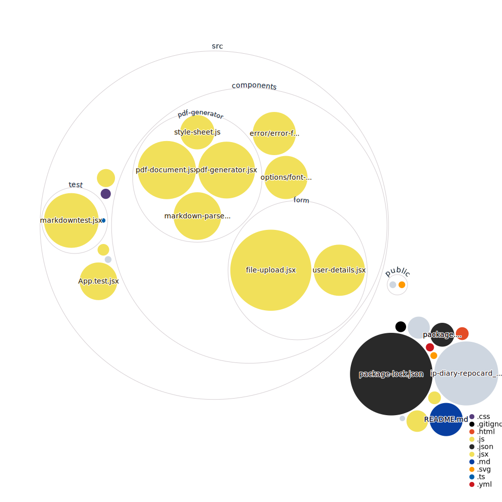

IP Diary Generator is a client-side application built with Vite, React, and JavaScript. It allows users to generate a diary in PDF format by uploading a CSV file or providing a public Google Sheets link. The application ensures data privacy as no data is shared with the server; everything is handled locally in the browser using local storage for persistence.

## Live Site

Check out the live version of the IP Diary Generator [here](https://tanishq-cloud.github.io/ip-diary/).

## Features

- **Client-Side Rendering**: All data processing happens in the browser, ensuring data privacy.
- **Local Storage**: Uses browser local storage for data persistence.
- **CSV and Google Sheets Support**: Generate diaries from CSV files or public Google Sheets links.
- **PDF Generation**: Export the generated diary as a PDF.

## Getting Started

### Prerequisites

- Node.js and npm installed on your machine.

### Installation

1. **Clone or Fork the Repository**:

   ```bash
   git clone https://github.com/tanishq-cloud/ip-diary.git
   cd ip-diary
   ```

2. **Create a New Branch for Contribution**:

   ```bash
   git checkout -b your-feature-branch
   ```

3. **Install Dependencies**:

   ```bash
   npm install
   ```

4. **Set Up Pre-Commit and Pre-Push Hooks**:
   ```bash
   npx lefthook install
   ```

### Running the Application

```bash
npm run dev
```

### Testing

IP Diary Generator uses Vitest for component testing. Run the tests using:

```bash
npm run test
```

## Contributing

Contributions are welcome! Please follow these steps:

1. Fork the repository and create a new branch for your feature or bug fix.
2. Make your changes and ensure all tests pass.
3. Create a pull request with a detailed description of your changes.

## Future Enhancements

- **Direct Writing Tasks**: Allow users to write diary entries directly from the browser.
- **Cloud-Based Saving**: Implement cloud storage options for saving diaries.
- **More Connectors**: Add support for more data sources like Microsoft Excel.

## Repository Visualization



## License

This project is licensed under the MIT License. See the [LICENSE](LICENSE) file for details.
